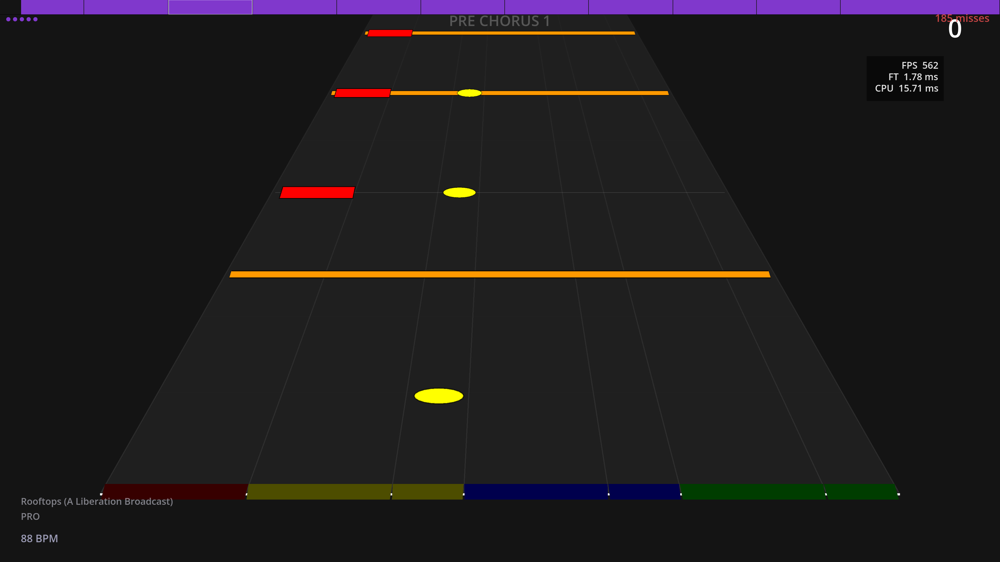

# DRUMWRIGHT

A drum rhythm game for Windows. Play along to your existing song library using a MIDI drum kit, controller, keyboard, or touchscreen.

> **Alpha build — v0.1.** Expect rough edges. Bug reports welcome via GitHub Issues.

---

## Download

Grab the installer from the [Releases](../../releases) page.

Requires Windows 10 or later.

---

## Songs

Drumwright uses Clone Hero-compatible song folders. If you already have a Clone Hero library, point Drumwright at it during setup, no duplication required.

Songs are imported on first load. Drumwright writes a small `.dcht` file into each song folder alongside the existing audio; everything else stays untouched.

**I don't think this breaks Clone Hero, as all it does is add a ".dcht" chart file and optionally a "preview.ogg" audio file. Please let me know if it causes issue.**

---

## Setup

1. Run the installer
2. Launch Drumwright — the setup wizard will open automatically
3. Choose your input method and bind your controls
4. Point the game at your songs folder
5. Run audio calibration so hit timing lines up with your hardware

Library loading will take a long time on your first launch while it caches your library and will be substantially faster on subsequent launches.

---

## Input

| Method | Notes |
|---|---|
| MIDI drum kit | Any standard e-kit; map pads to lanes in settings |
| Controller | Xbox / PlayStation / generic gamepad |
| Keyboard | Fully rebindable |
| Touchscreen | Tap lanes on screen |

---

## Game Modes

**Normal** — 5 lanes. Kick, snare, hi-hat, and two toms. Good starting point.

**Pro** — 8 lanes. Adds cymbals and open/closed hi-hat distinction.

**Authentic** — 8 lanes. Full chart including ghost notes, rimshots, foot splashes, and hi-hat modifiers. As close to actually playing the song as the chart allows.

Higher modes earn more XP. You can switch mode per-song at any time.

---

## Features

- Dynamic Difficulty — notes adapt per-section based on your accuracy history
- Practice mode — loop any section, adjustable difficulty band
- Calibration — separate audio and display offset, built-in tap calibration tool
- XP & levelling — persistent across sessions with one-time accuracy bonuses
- Playlists and favourites
- Song search, sort, and filter

---

## Known Issues / Limitations

- Windows only
- Song import requires `batch_convert.exe` to be present alongside `drumwright.exe`
- Windows Defender may flag `batch_convert.exe` on first run — this is a false positive; allow it through if prompted
- Some Clone Hero charts with non-standard stems may not import correctly

---

## Credits

Built with [Godot Engine](https://godotengine.org).
